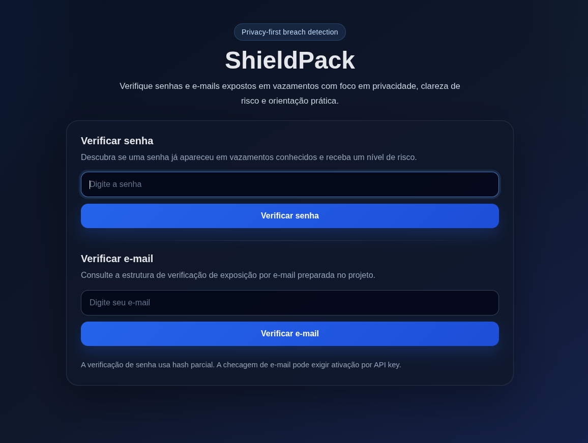
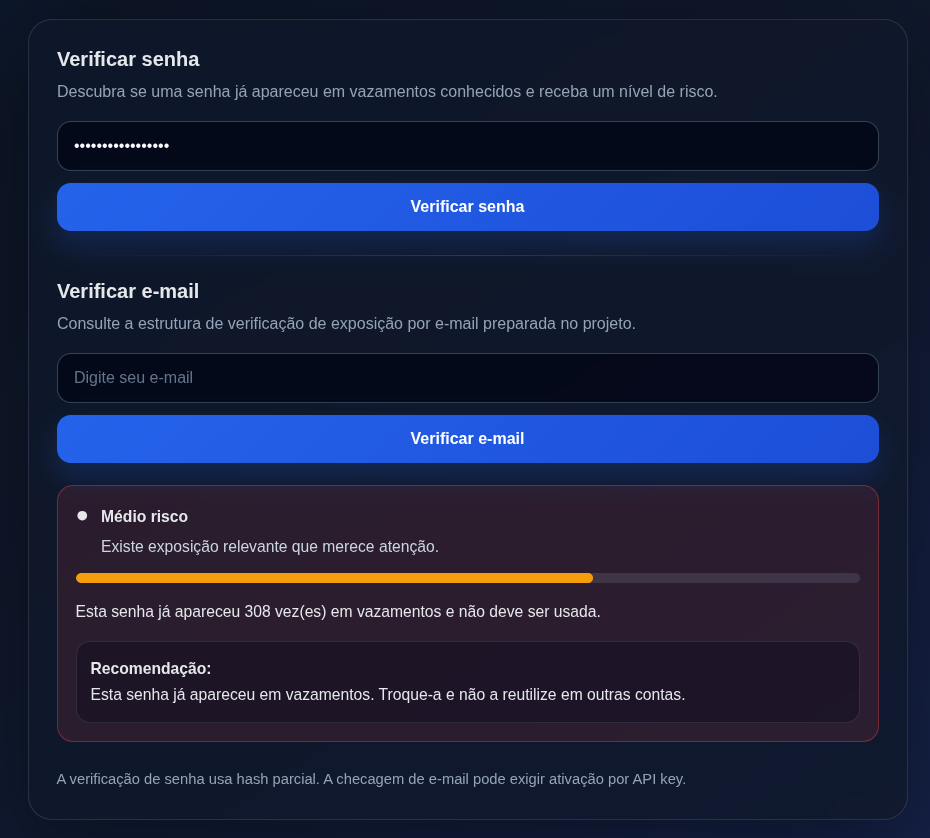
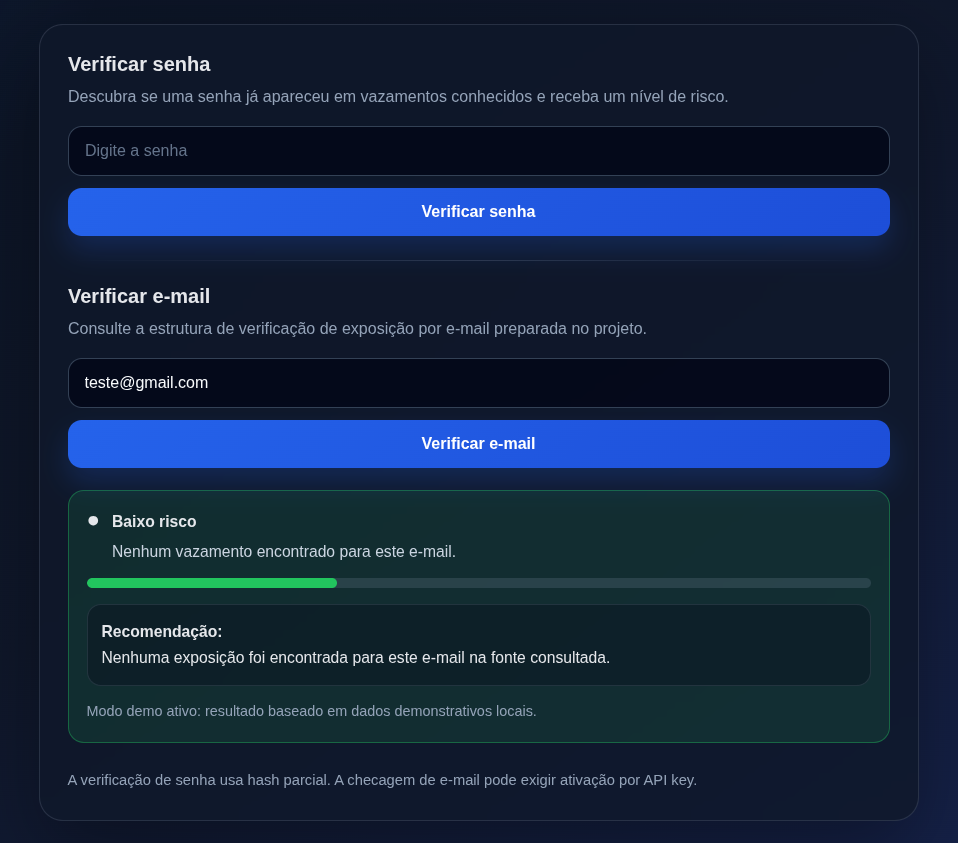

# ShieldPack

Privacy-first breach detection tool.

ShieldPack helps users evaluate digital exposure through password breach detection and future-ready email breach architecture.

---

## Features

- Password breach detection (hash range approach)
- Visual risk score
- Risk meter
- Email breach structure (API-ready)
- Environment configuration
- Responsive interface

---

## Why

People deserve simple tools that explain risk instead of only reporting data.

ShieldPack was built to transform exposure checks into understandable decisions.

---

## Screenshots

<<<<<<< HEAD
Coming soon.
=======
### Home



### Password Risk



### Email Demo



---

## Stack

### Frontend

- HTML
- CSS
- JavaScript

### Backend

- FastAPI
- Pydantic
- HTTPX

### Infrastructure

- Python
- Environment variables
- Modular architecture

---

## Running locally

```bash
git clone <repo>

cd ShieldPack

python3 -m venv .venv

source .venv/bin/activate

pip install -r requirements.txt

uvicorn app.main:app --reload
```

Open:

```text
http://127.0.0.1:8000
```

---

## Roadmap

- [x] Password breach detection
- [x] Risk scoring
- [x] Email verification structure
- [ ] Deploy
- [ ] Dashboard
- [ ] Analytics
- [ ] Threat insights

---

## Security

Passwords are not transmitted in plain text.

This project is designed for educational and privacy-focused purposes.

---

Built with care.


